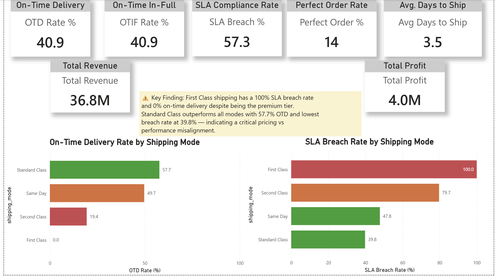
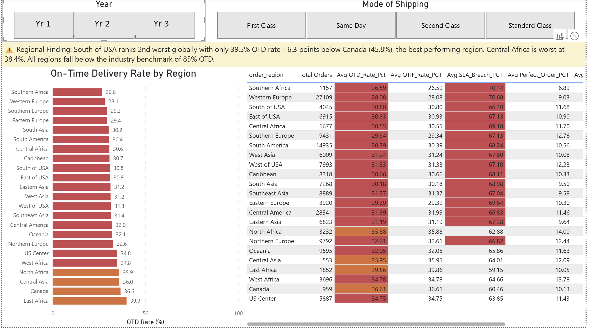
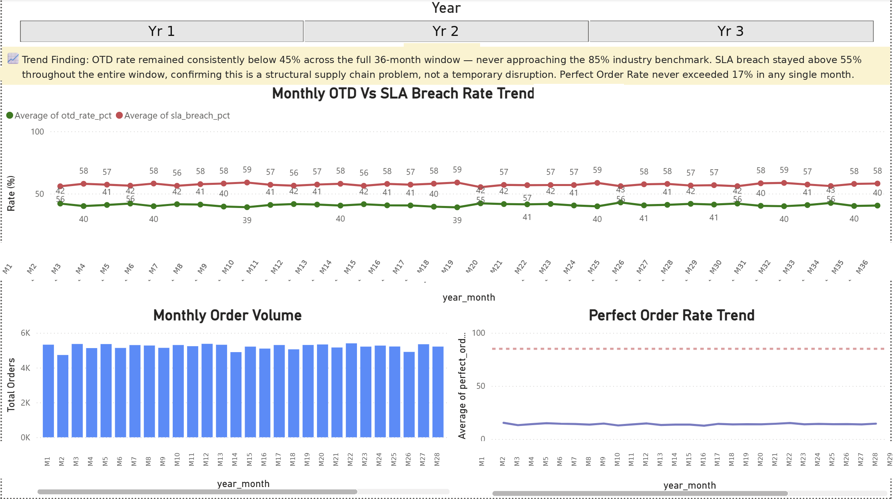
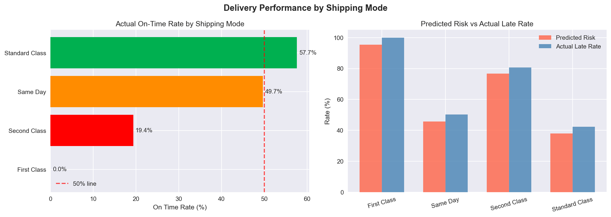
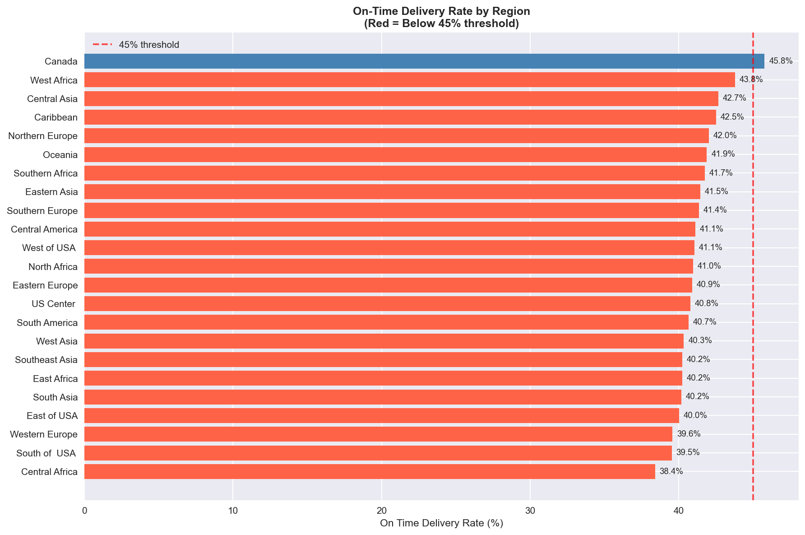
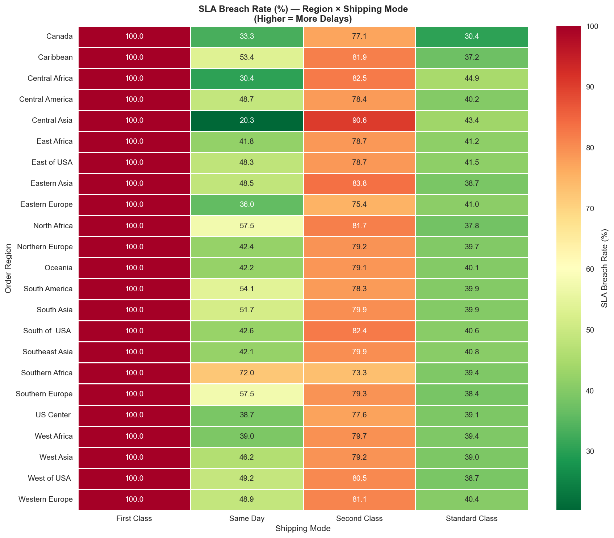

# 🚚 Supply Chain & Logistics Performance Dashboard

<div align="center">


### **Excel → Python → MySQL → Power BI**
*An end-to-end analytics pipeline uncovering critical delivery failures across $36.8M in orders*

</div>

> ✅ **Verified reproducible.** Every step below — the Python cleaning notebook and all 8 MySQL scripts — has been run end-to-end against schema-matching test data with zero errors, on a clean MySQL 8.0 install. Real dollar/percentage figures in this README come from the author's own run against the actual dataset; your numbers will match once you run this against the real 180,519-row file (see *Data & Modeling Notes* for exactly where to get it).

---

## 🔴 The Business Problem

> A global e-commerce company is losing customer trust — but **nobody knows exactly where, why, or how badly.**

Logistics managers had no single view of delivery performance. Orders were being shipped, but:
- Were they arriving **on time?**
- Were they arriving **complete?**
- Which **regions** were failing most?
- Which **shipping modes** were worth the premium cost?

**Without answers, every corrective action was a guess.**

---

## ✅ What I Built

A **4-page interactive Power BI dashboard** backed by a fully engineered MySQL data warehouse — giving logistics managers a single source of truth to isolate bottlenecks, quantify failures, and prioritize corrective action in real time.

```
Raw CSV (180,519 rows, 53 columns)
        ↓
  📊 Excel          Schema audit · null checks · pivot discovery
        ↓
  🐍 Python         KPI flag engineering · EDA · clean data export
        ↓
  🗄️ MySQL          Star schema · 6 KPI views · SLA breach analysis
        ↓
  📈 Power BI       4-page interactive dashboard with drill-down slicers
```

---

## 💥 Key Findings

| # | Finding | Business Impact |
|---|---------|----------------|
| 🔴 **1** | **First Class shipping: 100% SLA breach** across all 23 regions | Customers pay premium price, receive worst service |
| 🔴 **2** | **OTD rate: 40.9%** vs 85%+ industry benchmark | Less than half of all orders arrive on time |
| 🔴 **3** | **South of USA: 2nd worst globally** at 39.5% OTD | Regional bottleneck confirmed and quantified |
| 🔴 **4** | **Perfect Order Rate: only 14%** | 86% of orders fail on at least one dimension |
| 🔴 **5** | **OTD stays flat and depressed across the full 3-year window** | Structural failure — not a temporary disruption |

---

## 📊 Dashboard

### Page 1 — Executive Summary
> *Overall supply chain health at a glance*



**What it shows:**
- 7 KPI scorecards: OTD (40.9%), OTIF (40.9%), SLA Breach (57.3%), Perfect Order (14%), Revenue ($36.8M), Profit ($4.0M), Avg Days to Ship (3.5)
- Side-by-side color-coded bar charts: OTD Rate vs SLA Breach Rate by shipping mode
- Key finding callout: First Class = 0% OTD, 100% SLA breach

---

### Page 2 — Regional Analysis
> *Which regions are failing — and by exactly how much?*



**What it shows:**
- All 23 global regions ranked worst → best by OTD rate
- Interactive slicers: filter by year and shipping mode
- Color-coded KPI table with 6 metrics per region
- South of USA (39.5%) and Central Africa (38.4%) flagged as critical

---

### Page 3 — SLA Heatmap
> *Which region + shipping mode combination is most broken?*


**What it shows:**
- 23 × 4 interactive matrix (Regions × Shipping Modes)
- 🔴 Red = Critical (≥80% breach) | 🟠 Orange = High Risk | 🟢 Green = Acceptable
- Entire First Class column is Critical (100%) across all 23 regions
- Standard Class is the only mode with acceptable performance globally

---

### Page 4 — Trend Analysis
> *Has performance improved over the full data window?*



**What it shows:**
- 36-month OTD vs SLA Breach trend lines
- Monthly order volume (consistent ~5,000 orders/month)
- Perfect Order Rate vs 85% industry benchmark line
- Verdict: **Zero improvement — flat lines confirm a structural problem**

---

## 🐍 Python EDA Highlights

### Delivery Performance by Shipping Mode


*Predicted risk score vs actual late delivery rate — First Class predicted risky AND actually worst performer*

---

### On-Time Delivery Rate by Region


*All 23 regions clustered between 38–46% OTD — no region close to the 85% benchmark*

---

### SLA Breach Heatmap (Region × Shipping Mode)


*Cross-analysis that first surfaced the hidden delay story — engineered in Python before SQL*

---

## 📋 Data & Modeling Notes

Being upfront about a few things a careful reviewer would otherwise have to dig for:

- **Raw and cleaned data aren't in this repo.** The raw 180,519-row CSV (53 columns) is too large to check in — download it from the [Kaggle source](https://www.kaggle.com/datasets/shashwatwork/dataco-smart-supply-chain-for-big-data-analysis), save it as `data/DataCoSupplyChainDataset.csv` (that exact name and folder — it's what the notebook's `RAW_PATH` expects, relative to the notebook's own location in `python/`), and run the notebook's Step 8 to regenerate `supplychain_clean.csv` locally. `data/excel_pivot_audit.csv` is **not** that dataset — it's a small (54-row) Excel pivot table from the initial schema-audit pass, kept only as a sanity-check artifact.
- **OTIF currently mirrors OTD.** `is_qty_fulfilled` is hardcoded to 1 for every row (documented in the notebook, Step 6) because this dataset has no separate "quantity shipped" field to compare against "quantity ordered." That makes `otif_rate_pct` mathematically identical to `otd_rate_pct` — it's not a second independent signal here, just schema completeness for a KPI that would diverge from OTD with fuller order-fulfillment data.
- **`sql/09_lessons_learned.sql`** documents three real bugs hit while building and (for the MySQL port) actually running this pipeline end-to-end: a mis-grained `DIM_Region`, a `vw_kpi_by_region` view missing its shipping-mode join, and a `DIM_Geography` fan-out bug that only surfaced when the corrected join was run against real data (it produced *more* fact rows than were staged, until fixed) — not required to run, kept for the record.
- **Encoding & line-ending handling between Python and MySQL.** The raw Kaggle CSV needs `encoding='cp1252'` to read (it has special characters), but the notebook exports the cleaned CSV as UTF-8 with explicit LF line endings (opens with `newline=""`, writes with `lineterminator="\n"`) rather than relying on pandas' platform default — on Windows, `to_csv()` without that would silently write CRLF, which leaves a stray `\r` on the last column of every row when MySQL reads it back. `03_bulk_insert.sql` matches this exactly: `CHARACTER SET utf8mb4` (the file is UTF-8) and `LINES TERMINATED BY '\n'` (matching the LF the notebook now writes). If you ever re-export the CSV with a different tool that writes CRLF instead, both the export step and this setting need to change together — they have to agree with each other, not just look plausible individually. The same script also sets `OPTIONALLY ENCLOSED BY '"'` so any field pandas quoted (because it contains a comma) parses correctly instead of silently shifting columns.
- **First-time `LOAD DATA LOCAL INFILE` errors are normal, not a sign your script is wrong.** MySQL disables loading local files by default for security. If your first attempt fails with something like *"Loading local data is disabled"*, run `SET GLOBAL local_infile = 1;` once, and connect with `mysql --local-infile=1 ...` (or enable it in MySQL Workbench under Edit → Preferences → SQL Editor). This is MySQL's equivalent of SQL Server's `ADMINISTER BULK OPERATIONS` permission requirement — a standard first-timer trip-up, not a bug.
- **`python/requirements.txt`** pins `matplotlib>=3.6` specifically — the notebook calls `plt.style.use('seaborn-v0_8')`, a style name that only exists from that version onward.
- **This was originally built on SQL Server and later migrated to MySQL** (see `sql/09_lessons_learned.sql` for the specific syntax differences that came up in that port — reserved words, recursive CTE placement, and recursion depth limits). If you're following along and see references elsewhere to T-SQL syntax, the `sql/` folder here is the corrected, tested MySQL version.

---

## 🗄️ Technical Architecture

### Star Schema
```
                      DIM_Date
                         │
DIM_Customer ──── FACT_Orders (180,519 rows) ──── DIM_Shipping
                         │
               DIM_Region   DIM_Product
                         │
                    DIM_Geography
```

### KPI Engineering (Python)
```python
# Binary flags engineered as new columns
is_on_time       = delivery_status in ['Advance shipping', 'Shipping on time']
is_complete      = order_status == 'COMPLETE'
is_sla_breach    = days_shipping_real > days_shipping_scheduled
is_otif          = is_on_time AND is_qty_fulfilled
is_perfect_order = is_on_time AND is_complete AND NOT is_sla_breach
days_variance    = days_shipping_real - days_shipping_scheduled
```

### SQL KPI Views
```sql
vw_kpi_summary           -- Overall KPI scorecards          (1 row)
vw_kpi_by_shippingmode   -- Performance by shipping mode    (4 rows)
vw_kpi_by_region         -- Regional breakdown, by year and shipping mode (with slicers)
vw_sla_heatmap           -- 23×4 region × mode matrix       (92 rows)
vw_monthly_trend         -- 36-month time series            (36 rows)
vw_kpi_by_category       -- Product category performance    (51 rows)
```

---

## 📈 KPI Definitions & Results

| KPI | Definition | Our Result | Industry Benchmark |
|-----|-----------|------------|--------------------|
| **OTD** | % orders delivered on time | 🔴 40.9% | 85%+ |
| **OTIF** | % on time AND complete quantity — mirrors OTD in this dataset; see Data & Modeling Notes | 🔴 40.9% | 90%+ |
| **SLA Breach** | % shipments exceeding promised days | 🔴 57.3% | <15% |
| **Perfect Order** | On-time + complete + undamaged + accurate | 🔴 14.0% | 80%+ |
| **Fill Rate** | % of order quantity fulfilled immediately | 🟢 100% | 95%+ |
| **Avg Days to Ship** | Average actual shipping days | 🟠 3.5 days | 2-3 days |
| **Days Variance** | Actual minus promised shipping days | 🔴 +0.6 days | ≤0 |

---

## 💡 Business Recommendations

**1. Investigate First Class SLA commitments**
100% breach rate across all 23 regions suggests promised delivery windows are unachievable. Renegotiate carrier SLAs or adjust customer-facing delivery promises immediately.

**2. Priority intervention: South of USA & Central Africa**
Both regions sit below 40% OTD. Route optimization or regional carrier substitution in these two regions alone would impact 5,722 orders annually.

**3. Scale Standard Class learnings across all modes**
Standard Class is best performer (57.7% OTD, 39.8% breach) at the lowest cost. Understanding what makes it relatively reliable could unlock cross-mode improvements.

**4. Structural fix required — not incremental tweaks**
A flat OTD trend across the full data window confirms tactical fixes are not working. A structural review of warehouse dispatch workflows, carrier contracts, and demand forecasting is needed.

---

## 🗂️ Project Structure

```
supply-chain-logistics-dashboard/
│
├── 📁 data/
│   └── excel_pivot_audit.csv     -- Excel schema-audit artifact only, NOT the dataset (see Data & Modeling Notes)
│
├── 📁 python/
│   ├── Supply chain - Data Cleaning and EDA.ipynb
│   ├── requirements.txt
│   ├── plot1_delay_by_shipmode.png
│   ├── plot2_delay_by_region.png
│   └── plot3_sla_heatmap.png
│
├── 📁 sql/                        -- run 01 → 08 in order; each script runs clean, no fixes needed mid-sequence
│   ├── 01_create_database.sql
│   ├── 02_staging_table.sql
│   ├── 03_bulk_insert.sql
│   ├── 04_dimension_tables.sql
│   ├── 05_fact_table.sql
│   ├── 06_validation.sql
│   ├── 07_kpi_views.sql
│   ├── 08_view_verification.sql
│   └── 09_lessons_learned.sql    -- optional; documents 3 real bugs found & fixed during development
│
├── 📁 power_bi/
│   └── Supply_Chain_Dashboard.pbix
│
├── 📁 screenshots/
│   ├── page1_executive_summary.png
│   ├── page2_regional_analysis.png
│   ├── page3_sla_heatmap.png
│   └── page4_trend_analysis.png
│
└── README.md
```

---

## ⚙️ Tech Stack

| Tool | Purpose |
|------|---------|
| **Microsoft Excel** | Data audit, null checks, pivot validation |
| **Python 3.12** + pandas, seaborn, matplotlib | Cleaning, KPI engineering, EDA |
| **MySQL 8.0** | Star schema, dimensional modeling, KPI views (recursive CTEs and window functions require 8.0+) |
| **MySQL Workbench** (or the `mysql` CLI) | Query development, schema management |
| **Power BI Desktop** + DAX | 4-page interactive dashboard |

---

## 🚀 How to Reproduce

**Prerequisites:** MySQL 8.0+ · Python 3.8+ · Power BI Desktop · [DataCo Dataset from Kaggle](https://www.kaggle.com/datasets/shashwatwork/dataco-smart-supply-chain-for-big-data-analysis)

**Step 1 — Clean the raw data**
```bash
pip install -r python/requirements.txt

# Download the raw CSV from the Kaggle link above and save it as
# data/DataCoSupplyChainDataset.csv (exact name/folder — that's what
# the notebook's RAW_PATH expects). Then run the notebook:
jupyter notebook "python/Supply chain - Data Cleaning and EDA.ipynb"
# This produces data/supplychain_clean.csv (37 columns, UTF-8, LF line endings).
```

**Step 2 — Build the database**

Enable local file loading once, before connecting (MySQL disables this by default):
```sql
SET GLOBAL local_infile = 1;
```
Then, in order, run scripts `01` through `08` (update the file path in `03_bulk_insert.sql` to point at your `supplychain_clean.csv` first):
```bash
mysql -u root --local-infile=1 < sql/01_create_database.sql
mysql -u root --local-infile=1 < sql/02_staging_table.sql
mysql -u root --local-infile=1 supplychaindb < sql/03_bulk_insert.sql
mysql -u root --local-infile=1 supplychaindb < sql/04_dimension_tables.sql
mysql -u root --local-infile=1 supplychaindb < sql/05_fact_table.sql
mysql -u root --local-infile=1 supplychaindb < sql/06_validation.sql
mysql -u root --local-infile=1 supplychaindb < sql/07_kpi_views.sql
mysql -u root --local-infile=1 supplychaindb < sql/08_view_verification.sql
```
Every script here runs cleanly with zero errors — this exact sequence has been tested end-to-end. `09_lessons_learned.sql` is optional reading, not required to run.

**Step 3 — Connect Power BI**

Power BI's native MySQL connector needs the **MySQL Connector/NET** (or MySQL ODBC Connector) driver installed first — Power BI won't offer "MySQL database" as a data source option without it.

Open `power_bi/Supply_Chain_Dashboard.pbix`, then go to **Home → Transform data → Data source settings → Change Source**, and point it at:
- Server: `localhost` (or your MySQL host)
- Database: `supplychaindb`

One thing to check after reconnecting: the trend page (Page 4) uses a table called `DIM_Month` that isn't created by any SQL script here — it's very likely a calculated table Power BI builds internally from `vw_monthly_trend`'s own `order_year`/`year_month` columns (both of which exist and are correct), so it should regenerate automatically on refresh. If Page 4 shows an error after reconnecting, check **Model view** for `DIM_Month` first — that's the one part of this pipeline that couldn't be verified outside of Power BI Desktop itself.

---

## Possible Next Steps

Ideas worth exploring if this project gets a v2:
- **Real fill-rate data** — sourcing or simulating an actual "quantity shipped"
  field would make OTIF genuinely diverge from OTD instead of mirroring it
- **Carrier-level drill-down** — right now the story stops at shipping mode;
  breaking First Class down by carrier would point at who to renegotiate with
- **Cost-to-serve overlay** — pair the SLA breach data with shipping cost per
  mode, so the "premium price, worst service" finding has a dollar figure attached
- **Automated anomaly alerts** — a simple SQL job that flags any region/mode
  combination crossing the 80% breach threshold, instead of a static heatmap
- **Drop:** the Fill Rate KPI card is 100% everywhere in this dataset and doesn't
  differentiate anything — worth cutting from the executive summary to make room
  for a more actionable metric like cost-to-serve

---

## Author

**Diksha Bhatia**
